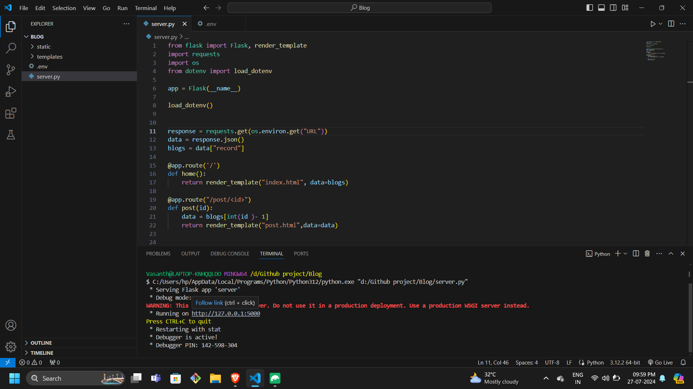
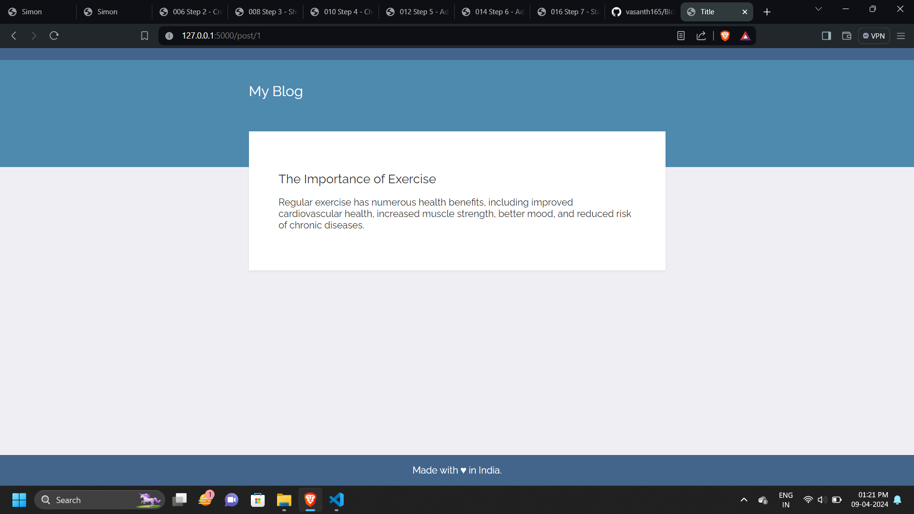

# Blog

This project fetches data from a JSON file using the request module in Python and uses that data to create a webpage with summaries of blog posts. Users can click on the summaries to view the full content of each blog post on separate pages.

## How It Works

1. **JSON Data**: The project fetches data from a JSON file using the request module in Python.
2. **Data Processing**: The fetched data is then processed to extract relevant information for the webpage.
3. **Webpage Creation**: Using the extracted data, the project dynamically generates summaries of blog posts on the starting webpage.
4. **Navigation**: Users can click on the summaries to view the full content of each blog post on separate pages.

## Images

1. **Running the Python Server**:  
     
   This image shows the command used to run the Python server.

2. **Web Page**:  
     
   This image displays the starting webpage with summaries of blog posts.

3. **Viewing a Post**:  
     
   This image shows the individual blog post page after clicking on the "Read" link.
